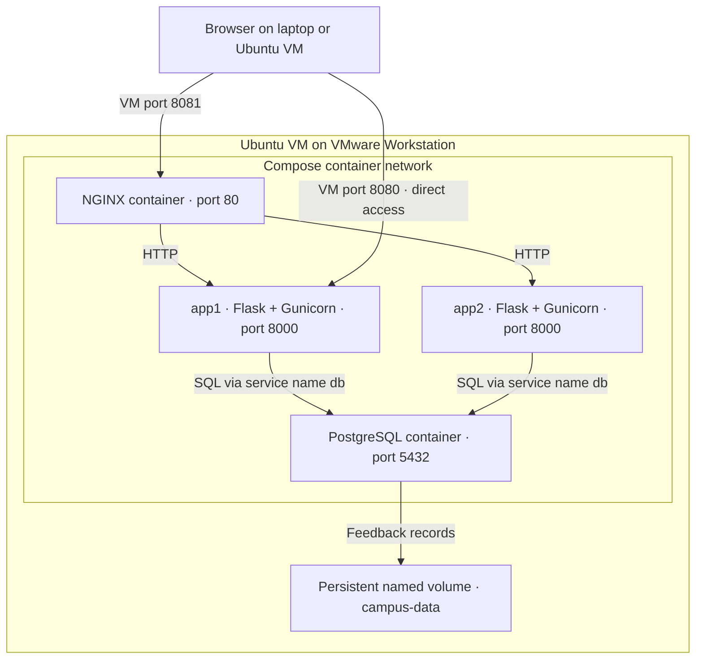

# Linux Container Workshop 2026

**Campus Feedback App — build, connect and scale a multi-container application.**

Prepared for Abhishek Gupta's Linux and containers workshop. Target: an Ubuntu 26.04 LTS amd64 VM on VMware Workstation. This is a teaching lab, not a production deployment.

## Start here

All source, YAML and configuration files are browsable in this repository. For a ZIP copy, use **Code → Download ZIP** on GitHub. Extract it and open a terminal in the extracted project directory; no separate ZIP needs to be committed to Git.

1. [Prepare the Ubuntu VM](labs/00-setup.md).
2. [Learn Linux and run your first container](labs/01-linux-containers.md).
3. [Build and connect the feedback app](labs/02-build-connect.md).
4. [Add load balancing and test persistence](labs/03-scale-persist.md).
5. [Publish images and prepare offline delivery](labs/04-publish-offline.md).
6. [Troubleshooting](troubleshooting.md) and [instructor checklist](INSTRUCTOR.md).

## Quick start: build on your VM

Run inside the Ubuntu VM after Docker installation:

```bash
git clone https://github.com/dception01/linux_container_workshop.git
cd linux_container_workshop
cp .env.example .env
bash scripts/preflight.sh
docker compose -f compose.yaml -f compose.build.yaml up -d --build --wait
docker compose ps
```

Open **http://localhost:8080** in the VM browser. From the laptop browser, use **http://VM_IP:8080**; find VM_IP with `hostname -I` inside Ubuntu. The host must be able to reach that VMware guest address. Do not use the laptop's localhost for a service running in the VM.

Submit feedback. The page shows the serving instance, database status, feedback count and average rating.

## Add a second instance and NGINX

After the build above, the application image exists locally:

```bash
docker compose -f compose.yaml -f compose.lb.yaml pull nginx
docker compose -f compose.yaml -f compose.lb.yaml up -d --pull never --wait
```

Open **http://localhost:8081** (or `http://VM_IP:8081` from the laptop). Port 8080 goes directly to app1; **8081 is the load-balanced endpoint**.

```bash
for i in $(seq 1 10); do curl -s http://localhost:8081/healthz; echo; done
```

Expect both `app-1` and `app-2` across multiple requests, not a guarantee of perfect alternation.

## Prepared-image path

This path requires the instructor to publish the image first; committing this repository does not publish the image automatically. See [publishing](labs/04-publish-offline.md).

```bash
cp .env.example .env  # first setup only; do not overwrite your later edits
docker compose -f compose.yaml -f compose.lb.yaml pull
docker compose -f compose.yaml -f compose.lb.yaml up -d --wait
```

## What students build

A browser-based Campus Feedback app. A student enters a team name, a rating from 1 to 5 and a short comment. Flask validates the submission, stores it in PostgreSQL, and renders the latest feedback, response count and average rating. Each page also identifies which application instance served it.

**Why Flask?** The project uses one small Python application and server-rendered HTML, so students can follow the request flow without first learning a separate JavaScript framework. Gunicorn runs the Flask application inside the container. PostgreSQL is a separate container; HTML templates are part of the application image.

## Architecture: where everything runs



Start with **app1 and PostgreSQL**. Later add **app2 and NGINX**. Both app containers run the same image and share the database. Database port 5432 is internal and is not published on the VM. This is a multi-container application; adding containers alone does not make a complete microservices architecture.

## What happens when you submit feedback?

1. The browser sends `POST /feedback` to port 8080 (direct) or 8081 (load balanced).
2. For port 8081, NGINX forwards the request to an available application instance.
3. Flask validates the fields and sends a parameterized INSERT to PostgreSQL.
4. PostgreSQL stores the record in its data directory on the named volume.
5. Flask returns a redirect; the browser loads the page again and sees updated feedback.
6. That page request may reach the other replica, which sees the same shared database.

## Step-by-step workshop checkpoints

| Stage | Configuration or files | Observable result |
| --- | --- | --- |
| 1. Prepare Linux | [VM setup](labs/00-setup.md) | Docker and Compose work inside Ubuntu |
| 2. Explore containers | [First container](labs/01-linux-containers.md) | NGINX welcome page on port 8090 |
| 3. Build Flask image | [Dockerfile](Dockerfile), [application](app/app.py), [build lab](labs/02-build-connect.md) | Page opens without a database; storage status is disconnected |
| 4. Connect PostgreSQL | [compose.yaml](compose.yaml), [.env.example](.env.example), [schema](db/init.sql) | Feedback saves and reappears |
| 5. Rebuild with Compose | [compose.build.yaml](compose.build.yaml) | Local code is packaged and started reproducibly |
| 6. Add load balancing | [compose.lb.yaml](compose.lb.yaml), [NGINX config](nginx/default.conf) | Both instance names appear through port 8081 |
| 7. Test failure and persistence | [Scaling/persistence lab](labs/03-scale-persist.md) | Remaining replica serves requests; records survive container replacement |
| 8. Distribute the project | [Publishing/offline lab](labs/04-publish-offline.md) | Prepared images can be pulled or loaded offline |

The base YAML is always supplied first. The build YAML adds local build settings; the load-balancing YAML adds services. For the first rehearsal, follow the numbered labs. The quick-start commands above are a shortcut for instructors.

## Project files

| File | Purpose |
| --- | --- |
| `app/` | Flask application and interface |
| `Dockerfile` | Application image, running as a non-root user |
| `compose.yaml` | app1 + PostgreSQL + persistent volume |
| `compose.build.yaml` | Local application build override |
| `compose.lb.yaml` | app2 + NGINX extension |
| `db/init.sql` | First-start database schema |
| `nginx/default.conf` | Round-robin upstream configuration |
| `.env.example` | Lab-only settings; copy to `.env` |
| `.github/workflows/publish-image.yml` | Manually triggered image publishing |
| `scripts/` | Preflight and offline image export |

## Stop without deleting feedback

```bash
docker compose -f compose.yaml -f compose.lb.yaml down
```

The named volume remains. `down -v` deletes the workshop database permanently; only use it for an intentional fresh reset.

## Scope and validation

Manual replication and load balancing are demonstrated. Autoscaling is not implemented. A single VM, database and proxy remain shared failure points. Configuration uses demo credentials, plain HTTP and an unauthenticated form: keep it in your teaching environment with fictional data.

Dependency and image versions are explicit teaching baselines, not a security-update guarantee. Rehearse and review updates before each workshop. Image tags can change upstream; for a fully frozen release, record/pin tested digests after your rehearsal.

Automated application tests cover validation, storage-call behavior, escaping and database failures. A complete Docker/VM rehearsal is still required. See `VALIDATION.md` for checks actually performed during preparation.
